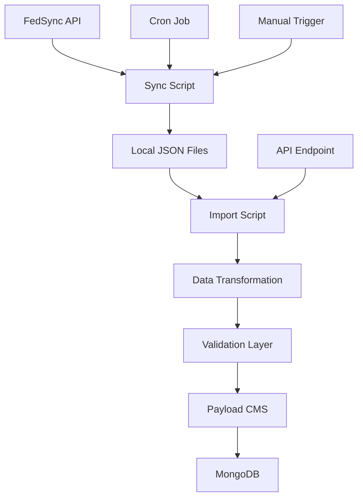
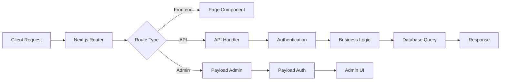

# Architecture Overview

[← Back to Main Documentation](./README.md) | [Current Progress](./PROGRESS-REPORT.md) | [Tech Stack Details](./TECH-STACK.md)

## System Architecture

Discover XYZ is built using modern web technologies with a focus on performance, scalability, and developer experience.

## Technology Stack

### Frontend
- **Framework**: Next.js 15.3.3 (App Router)
- **UI Library**: React 19.1.0
- **Language**: TypeScript 5.7.3 (strict mode enabled)
- **Styling**: Tailwind CSS 3.4.3 (v4 upgrade planned)
- **UI Components**: shadcn/ui (latest)
- **Forms**: React Hook Form 7.45.4
- **State Management**: React Context + Hooks

### Backend
- **CMS**: Payload CMS 3.45.0
- **Runtime**: Node.js 20+
- **Database**: MongoDB
- **Authentication**: Better Auth 1.3.4 + payload-auth 1.6.4
- **File Storage**: Local filesystem (configurable)

### Infrastructure
- **Package Manager**: pnpm 9+
- **Build Tool**: Next.js built-in
- **Testing**: Vitest 3.2.3
- **Linting**: ESLint 9.32.0 + Prettier 3.4.2
- **Type Checking**: TypeScript (strict mode)

## Application Structure

### Directory Layout

```
discover-xyz/
├── src/
│   ├── app/                      # Next.js App Router
│   │   ├── (frontend)/           # Public website pages
│   │   ├── (payload)/            # Payload CMS admin
│   │   └── api/                  # API routes
│   ├── collections/              # Payload collections
│   │   ├── Events/               # Events collection
│   │   ├── Profiles/             # Business profiles
│   │   ├── Categories/           # Taxonomies
│   │   ├── Users/                # User management
│   │   └── Media/                # File uploads
│   ├── components/               # React components
│   │   ├── ui/                   # Base UI components
│   │   ├── auth/                 # Authentication
│   │   └── graphics/             # Logo/icons
│   ├── scripts/                  # Utility scripts
│   │   └── import-fedsync/       # Data import system
│   ├── lib/                      # Utility libraries
│   ├── access/                   # Access control
│   └── payload.config.ts         # Payload configuration
├── docs/                         # Documentation
├── data/                         # External data files
├── logs/                         # Application logs
└── public/                       # Static assets
```

## Data Architecture

### Collections Schema

#### Events
```typescript
interface Event {
  id: string
  title: string
  description?: string
  calendar: CalendarEntry[]
  location: LocationInfo
  contact?: ContactInfo
  categories: Category[]
  photos?: Media[]
  fedSyncData?: SyncMetadata
}

interface CalendarEntry {
  startDate: Date
  endDate: Date
  startTime?: string
  endTime?: string
  recurring?: boolean
  notes?: string
}
```

#### Profiles (Business Listings)
```typescript
interface Profile {
  id: string
  name: string
  description?: string
  type: string
  address: AddressInfo
  coordinates: { lat: number; lng: number }
  hours: BusinessHours[]
  amenities: Amenity[]
  contact: ContactInfo
  photos?: Media[]
  videos?: VideoInfo[]
  accommodation?: AccommodationInfo
  fedSyncData?: SyncMetadata
}
```

#### Categories
```typescript
interface Category {
  id: string
  name: string
  slug: string
  description?: string
  parent?: Category
  children?: Category[]
}
```

### Relationships

- **Events → Categories**: Many-to-many
- **Profiles → Amenities**: Many-to-many
- **Events/Profiles → Media**: One-to-many
- **Categories**: Self-referential hierarchy

## Authentication Architecture

### Multi-Modal Authentication

1. **Payload Native Auth**
   - Email/password login
   - JWT tokens
   - Role-based access control

2. **OAuth Integration**
   - Google OAuth 2.0
   - Automatic user creation
   - Domain-based role assignment

3. **Session Management**
   - HTTP-only cookies
   - 7-day token expiration
   - Secure token generation

### Access Control

```typescript
// Role-based permissions
const accessControl = {
  admin: {
    collections: ['*'],
    actions: ['create', 'read', 'update', 'delete']
  },
  'content-editor': {
    collections: ['events', 'profiles', 'categories', 'media'],
    actions: ['create', 'read', 'update']
  },
  viewer: {
    collections: ['events', 'profiles', 'categories'],
    actions: ['read']
  }
}
```

## Data Flow Architecture

### FedSync Integration



### Request Flow



## Performance Architecture

### Optimization Strategies

1. **Database Optimization**
   - MongoDB indexes on frequently queried fields
   - Pagination for large datasets
   - Selective field projection

2. **Caching Strategy**
   - Next.js built-in caching
   - Static generation for public pages
   - API response caching

3. **Asset Optimization**
   - Image optimization with Next.js
   - Lazy loading for media
   - CDN for static assets (configurable)

### Monitoring

- Application logs in `/logs` directory
- Import job tracking
- Error tracking and reporting
- Performance metrics collection

## Security Architecture

### Security Layers

1. **Input Validation**
   - Zod schema validation
   - Payload built-in validation
   - Custom business rule validation

2. **Authentication & Authorization**
   - JWT token validation
   - Role-based access control
   - OAuth security best practices

3. **Data Protection**
   - Environment variable secrets
   - Secure HTTP headers
   - CORS configuration

4. **API Security**
   - Rate limiting
   - Request sanitization
   - Error message sanitization

## Deployment Architecture

### Environment Configuration

```bash
# Development
NEXT_PUBLIC_SERVER_URL=http://localhost:3026
DATABASE_URI=mongodb://localhost:27017/discover-xyz

# Production
NEXT_PUBLIC_SERVER_URL=https://yourdomain.com
DATABASE_URI=mongodb+srv://...
```

### Deployment Options

1. **Vercel** (Recommended)
   - Automatic deployments
   - Edge function support
   - Environment variable management

2. **Docker**
   - Containerized deployment
   - Docker Compose for local development
   - Scalable container orchestration

3. **Traditional Hosting**
   - VPS/dedicated server
   - PM2 process management
   - Nginx reverse proxy

### Database Hosting

- **MongoDB Atlas** (Recommended for production)
- **Local MongoDB** (Development)
- **Docker MongoDB** (Development/testing)

## Scalability Considerations

### Horizontal Scaling

- Stateless application design
- Database connection pooling
- Load balancer support
- CDN integration

### Performance Bottlenecks

1. **Database Queries**
   - Index optimization
   - Query optimization
   - Connection pooling

2. **File Uploads**
   - External storage integration
   - Image processing optimization
   - Async upload processing

3. **Import Operations**
   - Batch processing
   - Queue-based processing
   - Rate limiting

## Development Workflow

### Local Development

1. **Setup**
   ```bash
   pnpm install
   cp .env.example .env
   pnpm dev
   ```

2. **Database**
   - MongoDB running locally
   - Automatic database seeding
   - Test data generation

3. **Hot Reloading**
   - Next.js development server
   - TypeScript compilation
   - Tailwind CSS processing

### Quality Assurance

- **Type Safety**: TypeScript everywhere
- **Code Quality**: ESLint + Prettier
- **Testing**: Vitest unit/integration tests
- **Performance**: Lighthouse CI

## Integration Points

### External Services

1. **FedSync API**
   - REST API integration
   - Bearer token authentication
   - Rate limiting compliance

2. **OAuth Providers**
   - Google OAuth 2.0
   - Extensible for additional providers

3. **Email Services** (Future)
   - Transactional emails
   - Newsletter integration

4. **Analytics** (Future)
   - Google Analytics
   - Custom event tracking

### API Integrations

- **REST API**: Full CRUD operations
- **GraphQL**: Flexible data querying
- **Webhooks**: Real-time notifications

## Future Architecture Considerations

### Planned Enhancements

1. **Microservices Split**
   - Separate import service
   - Dedicated media service
   - User management service

2. **Caching Layer**
   - Redis integration
   - Distributed caching
   - Cache invalidation strategies

3. **Search Integration**
   - Elasticsearch integration
   - Full-text search
   - Faceted search

4. **Real-time Features**
   - WebSocket integration
   - Live updates
   - Real-time notifications

## Related Documentation

- [Development Guidelines](../CLAUDE.md) - Project standards and workflow
- [API Documentation](./API.md) - API endpoints and usage
- [FedSync Integration](./fedsync/README.md) - Data synchronization
- [Authentication Setup](./AUTH_SETUP.md) - OAuth configuration
- [Testing Guide](./TESTING.md) - Testing strategies

This architecture is designed to be maintainable, scalable, and developer-friendly while providing excellent performance and security for the Discover XYZ platform.